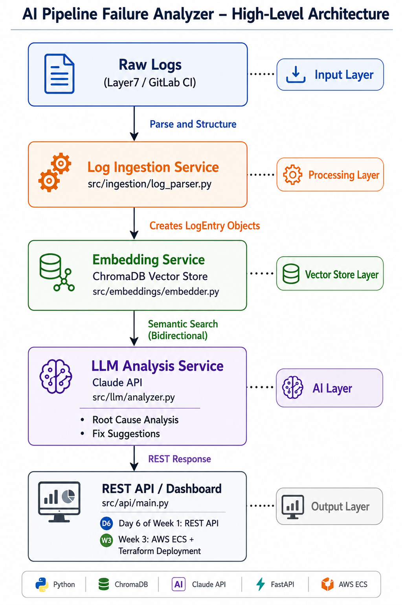

# AI Pipeline Failure Analyzer
 
> AI-powered root cause analysis for enterprise API gateway and CI/CD pipeline failures.
> Built with Python, LangChain, ChromaDB, and Claude/OpenAI API.
 
## Problem Statement
 
Enterprise API gateway failures (Layer7, Oracle Service Bus) and CI/CD pipeline
breakdowns cost engineering teams hours of manual log triage. This system ingests
raw failure logs, embeds them in a vector store for semantic search, and uses an LLM
to generate actionable root-cause summaries — reducing triage time from hours to minutes.
 
## Architecture

 

 
## Tech Stack
 
| Layer | Technology |
|-------|-----------|
| Language | Python 3.11 |
| AI Framework | LangChain |
| Vector Store | ChromaDB |
| LLM | Claude API (Anthropic) / OpenAI |
| API | FastAPI |
| Infra | Docker, Terraform, AWS ECS |
| Observability | Prometheus + Grafana |
 
## Project Status
 
- [x] Project scaffold and architecture defined
- [x] Log ingestion module
- [x] Vector embedding pipeline
- [x] LLM root cause analysis
- [ ] REST API layer
- [ ] Docker containerization
- [ ] Cloud deployment (AWS ECS)
 
## Week 1 Progress

Log ingestion: done. Embedding: done. LLM analysis: done. API layer: in progress (Day 6).

## Setup
 
```bash
git clone https://github.com/bhagya23/ai-pipeline-failure-analyzer.git
cd ai-pipeline-failure-analyzer
pip install -r requirements.txt
cp .env.example .env  # add your API keys
```
## Running the Pipeline

Run each module independently to verify the pipeline stage by stage:

```bash
# Parse and inspect log entries
python src/ingestion/log_parser.py

# Embed logs into ChromaDB and test semantic search
python src/embeddings/embedder.py

# Run the full RAG pipeline: retrieve similar logs + generate root cause analysis
python src/llm/analyzer.py
```

## Known Issues & Development Notes

While building this locally on Windows, I ran into and resolved a few environment and logic issues worth documenting:

### 1. Windows security policies blocking native ML library DLLs
**Symptom:** `ImportError: DLL load failed while importing _sfc64: An Application Control policy has blocked this file.`

**Investigation:** Initially suspected Windows Defender, since it's the more common cause of this class of error. Added Defender exclusions for `python.exe` and the `torch` package directory, and allowed `python.exe` under Controlled Folder Access. This did not resolve the issue — the same error persisted, ruling out Defender as the actual cause.

**Actual root cause:** Windows Smart App Control (enabled by default on some Windows 11 installations), which blocks certain native DLLs used by NumPy/SciPy that sentence-transformers depends on transitively via scikit-learn.

**Fix:** Disabled Smart App Control via Windows Security → App & browser control → Smart App Control. If already fully enabled and evaluated, a clean Windows reinstall is required instead — this is intentional Microsoft design, not a bug.

**Defensive coding added regardless:** Wrapped the `SentenceTransformerEmbeddingFunction(...)` initialization in `embedder.py` in a try/except that catches the Torch-load failure and falls back to ChromaDB's default embedding function instead of crashing. This means the pipeline degrades gracefully on any future environment where the specified model can't load, rather than hard-failing — useful defensive design even now that the root cause is fixed, since it protects against similar issues in other environments (e.g., a teammate's machine, a future OS update).

**Result:** With Smart App Control disabled, the intended `all-MiniLM-L6-v2` model now loads and runs correctly; the try/except fallback remains in the code as a safety net, not because it's currently needed.

### 2. Blank lines in log files are silently skipped (expected behavior)
**Symptom:** `[INFO] Parsed 29 entries, skipped 11 lines from ...` even though the log file "looks like" it only has valid entries.

**Cause:** Not a bug — the log file had 11 blank lines mixed in (from copy/paste formatting), and `parse_line()` intentionally returns `None` for empty lines without printing a warning, since blank lines aren't malformed input.

**Verify line counts on Windows (PowerShell doesn't have `wc -l`):**
\`\`\`powershell
(Get-Content data/sample_logs/layer7_failures.log).Count
(Get-Content data/sample_logs/layer7_failures.log | Where-Object { $_.Trim() -ne "" }).Count
\`\`\`

### 3. ChromaDB embedding function conflict after switching embedding models
**Symptom:** `ValueError: An embedding function already exists in the collection configuration, and a new one is provided.`

**Cause:** ChromaDB persists which embedding function created a collection. After fixing the Smart App Control issue and switching from the fallback embedding function to the intended sentence-transformer model, ChromaDB correctly refuses to mix embeddings from two different models in the same collection, since they aren't mathematically comparable.

**Fix:** Delete the persisted ChromaDB data directory and let it recreate cleanly:
\`\`\`powershell
Remove-Item -Recurse -Force data\chroma_db
\`\`\`

### 4. get_error_summary() was defined after __main__ and never invoked, plus missing a severity filter
**Symptom:** No "Error Summary" output appeared at all when running the script, despite the function existing in the file.

**Cause:** Two separate issues: (1) the function was defined *after* the `if __name__ == "__main__":` block, so it was never called; (2) the function counted all entries per source regardless of severity, rather than filtering to `severity == "ERROR"` — meaning even once wired in, it would have returned inflated, incorrect counts.

**Fix:** Moved the function definition above the `__main__` block (standard Python convention), added an explicit filter (`if not source or severity != "ERROR": continue`), and added a call to the function with printed output inside `__main__`.

**Lesson:** A function's name and presence in a file don't guarantee it does what it claims, or that it's even being executed — always verify actual printed output against expected values rather than assuming correctness from code review alone.

### 5. Full environment rebuild required: Python 3.14 incompatibility, missing C++ compiler, and a three-way dependency conflict
**Symptom:** After `sentence-transformers` was working correctly (see Issue #1), a fresh `pip install -r requirements.txt` on a clean environment failed with multiple cascading errors: `numpy` failing to build from source (Meson/compiler errors), `chroma-hnswlib` failing with "Microsoft Visual C++ 14.0 or greater is required," and finally a genuine three-way version conflict between `langchain==0.2.0` (requires `numpy<2`) and `scipy`/`scikit-learn` pulled in by `sentence-transformers` (requires `numpy>=2.0.0` in newer releases).

**Root cause:** The project's virtual environment had been created against **Python 3.14** — a version too new for several pinned dependencies to have pre-built Windows wheels available, forcing pip to compile them from source. Compiling requires a C/C++ toolchain (Microsoft Visual C++ Build Tools), which wasn't installed. Separately, `requirements.txt`'s exact-pinned versions (`chromadb==0.5.0`, `pandas==2.2.0`, `langchain==0.2.0`) were six months old relative to the rest of the ecosystem, causing them to demand sub-dependencies with no Windows wheel support or with mutually incompatible numpy requirements.

**Fix, in order:**
1. Recreated the virtual environment using **Python 3.12** instead of 3.14 (mature, fully wheel-supported across the ML/AI ecosystem):
   \`\`\`powershell
   py -3.12 -m venv .venv
   .\.venv\Scripts\Activate.ps1
   \`\`\`
2. Relaxed exact version pins to minimum-version constraints in `requirements.txt` (`chromadb>=0.5.0`, `pandas>=2.2.0`, `langchain>=0.2.0`, `langchain-community>=0.2.0`) so pip could resolve mutually compatible sub-dependency versions instead of being locked to a stale, conflicting dependency chain.
3. Added `sentence-transformers` explicitly to `requirements.txt` (previously installed manually, outside the requirements file — an oversight from initial setup).
4. Let pip's resolver settle on `numpy==1.26.4` and `scipy==1.17.1` as the mutually compatible versions satisfying both `langchain` and `sentence-transformers`' constraints.

**Verify a clean environment with:**
\`\`\`powershell
pip check
\`\`\`

**Lesson:** Exact version pins (`==`) in `requirements.txt` provide reproducibility at the moment they're written, but become a liability as the ecosystem moves — especially for fast-moving AI/ML libraries. A `.venv` should always be created against a mature, widely-supported Python version (currently 3.11–3.12 for this stack), not whatever the newest installed interpreter happens to be. When possible, relax pins to minimum-version constraints (`>=`) for dependencies without a strict compatibility reason to pin exactly, and let pip's resolver handle cross-package version compatibility.


### 6. Deleting a Python virtual environment can fail with "Access is denied" on Windows
**Symptom:** `Remove-Item -Recurse -Force .venv` fails partway through with `UnauthorizedAccessException` on `.pyd` files (e.g., inside `site-packages`).

**Cause:** A running process (often VS Code's Python/Pylance extension, or a Python interpreter left active in another terminal) holds a file lock on compiled extension files inside the venv, even when not actively executing code.

**Fix:** Close all VS Code windows and terminals, open a fresh standalone terminal (not inside an editor), and confirm no Python process is running (`Get-Process python`) before deleting the folder.


## Author
 
Bhagyashree Sahoo | Senior Platform Engineer | 10+ years enterprise integration
LinkedIn: linkedin.com/in/bhagyashree-sahoo2392
